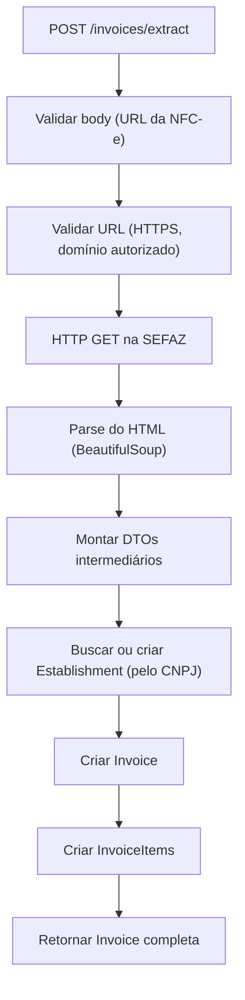
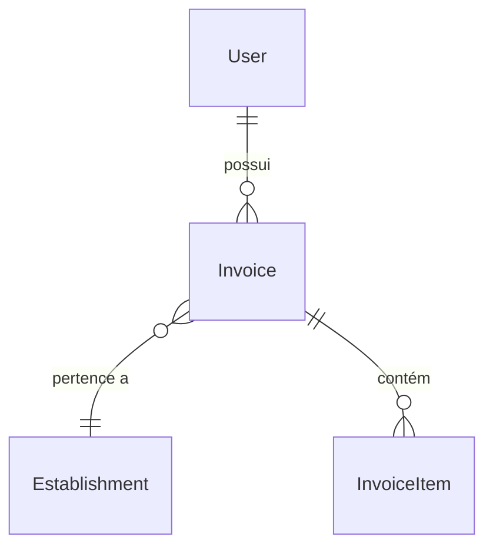

# Documentação MVP: Extração de NFC-e para FastAPI

> [!NOTE]
> Versão simplificada para MVP acadêmico em **Python + FastAPI**.
> Sem fila de jobs, sem invoice_requests, sem tabela de endereços separada.
> Fluxo **síncrono**: o usuário envia a URL → o sistema extrai e persiste → retorna a invoice pronta.

---

## 1. Visão Geral do Fluxo



> No sistema original Laravel, os passos D–I acontecem assincronamente via Job. No MVP, tudo ocorre **sincronamente** na mesma requisição.

---

## 2. Rota Principal

| Método | Rota | Descrição |
|--------|------|-----------|
| `POST` | `/invoices/extract` | Recebe URL de NFC-e, extrai dados e retorna a invoice criada |

---

## 3. Passo a Passo

### 3.1 — Request Body (DTO de Entrada)

O usuário envia apenas a URL da NFC-e:

```json
{
  "url": "https://nfce.fazenda.pr.gov.br/nfce/qrcode?p=..."
}
```

**Schema Pydantic:**
```python
from pydantic import BaseModel, field_validator
from urllib.parse import urlparse

ALLOWED_DOMAINS = ["fazenda.pr.gov.br"]

class ExtractInvoiceRequest(BaseModel):
    url: str

    @field_validator("url")
    @classmethod
    def validate_url(cls, v: str) -> str:
        parsed = urlparse(v)

        if parsed.scheme != "https":
            raise ValueError("A URL deve usar HTTPS")

        host = parsed.hostname or ""
        if not any(host == d or host.endswith(f".{d}") for d in ALLOWED_DOMAINS):
            raise ValueError("Domínio não autorizado")

        return v
```

**Regras de validação da URL (simplificadas do `InvoiceUrl` original):**

| Regra | Descrição |
|-------|-----------|
| HTTPS obrigatório | Scheme deve ser `https` |
| Domínio autorizado | Host deve pertencer a `ALLOWED_DOMAINS` |

---

### 3.2 — Fetch do HTML da SEFAZ

Faz uma requisição HTTP GET à URL informada:

```python
import httpx

async def fetch_sefaz_html(url: str) -> str:
    async with httpx.AsyncClient(timeout=15) as client:
        response = await client.get(url, headers={
            "Accept": "text/html,application/xhtml+xml",
            "Accept-Language": "pt-BR,pt;q=0.9",
        })
        response.raise_for_status()
        return response.text
```

---

### 3.3 — Parse do HTML (Extração de Dados)

O HTML da SEFAZ do Paraná é parseado usando seletores CSS. Aqui está **o que extrair** e **de onde**:

#### Dados do Estabelecimento

| Campo | Seletor / Regex | Exemplo resultado |
|-------|-----------------|-------------------|
| Nome | `#u20.txtTopo` → `.text()` | `"SUPERMERCADO EXEMPLO LTDA"` |
| CNPJ | `.txtCenter .text` que contém "CNPJ" → regex `CNPJ\s*:\s*(.*)` | `"12.345.678/0001-90"` |
| Endereço (texto) | `.txtCenter .text` que **não** contém "CNPJ" → primeiro match | `"RUA EXEMPLO, 123, SALA 1, CENTRO, CURITIBA"` |

#### Dados da Invoice

| Campo | Seletor / Regex | Tipo |
|-------|-----------------|------|
| Data emissão | `#infos ul li` → regex `Emissão:\s*(\d{2}/\d{2}/\d{4} \d{2}:\d{2}:\d{2})` | datetime |
| Valor total | `#totalNota #linhaTotal` → label "Valor a pagar" → `.totalNumb` | Decimal |
| Desconto | `#totalNota #linhaTotal` → label "Desconto" → `.totalNumb` (0 se ausente) | Decimal |

#### Itens (para cada `#tabResult tr` que contém `.txtTit2`)

| Campo | Seletor / Regex |
|-------|-----------------|
| `description` | `.txtTit2` → text |
| `code` | `.RCod` → regex `Código:\s*(\d+)` |
| `quantity` | `.Rqtd` → regex `Qtde\.\s*:\s*([\d,]+)` |
| `unit` | `.RUN` → regex `UN:\s*(.+)` |
| `unit_price` | `.RvlUnit` → regex `Vl\.\s*Unit\.\s*:\s*([\d,.]+)` |
| `total_price` | `.valor` → text |

#### Parse de decimais brasileiros

Valores como `"1.234,56"` precisam ser convertidos:

```python
import re
from decimal import Decimal

def parse_brazilian_decimal(value: str) -> Decimal:
    cleaned = re.sub(r"[^\d,.]", "", value.strip())
    cleaned = cleaned.replace(",", ".")
    return Decimal(cleaned)
```

#### Normalização de texto (para unidade do item)

```python
import unicodedata
import re

def normalize(value: str) -> str:
    value = value.lower()
    value = unicodedata.normalize("NFKD", value).encode("ascii", "ignore").decode()
    return re.sub(r"[^a-z0-9]", "", value)
```

---

### 3.4 — DTOs Intermediários (Resultado do Parse)

Schemas que representam os dados extraídos do HTML, **antes** de persistir:

```python
from pydantic import BaseModel
from decimal import Decimal
from datetime import datetime

class ParsedEstablishment(BaseModel):
    name: str
    business_tin: str        # CNPJ
    address: str             # endereço como texto puro

class ParsedInvoiceItem(BaseModel):
    description: str
    code: str
    unit: str
    quantity: Decimal
    unit_price: Decimal
    total_price: Decimal

class ParsedInvoice(BaseModel):
    establishment: ParsedEstablishment
    issued_at: datetime
    total_value: Decimal
    discount_value: Decimal
    items: list[ParsedInvoiceItem]
```

---

### 3.5 — Persistência no Banco

#### 1º — Establishment (buscar ou criar pelo CNPJ)

```python
# Pseudocódigo
establishment = db.query(Establishment).filter_by(business_tin=data.business_tin).first()

if not establishment:
    establishment = Establishment(
        name=data.name,
        business_tin=data.business_tin,
        address=data.address,
    )
    db.add(establishment)
    db.flush()
```

#### 2º — Invoice

```python
invoice = Invoice(
    user_id=current_user.id,
    establishment_id=establishment.id,
    total_value=data.total_value,
    discount_value=data.discount_value,
    issued_at=data.issued_at,
)
db.add(invoice)
db.flush()
```

#### 3º — Invoice Items (em lote)

```python
for item in data.items:
    db.add(InvoiceItem(
        invoice_id=invoice.id,
        description=item.description.upper(),
        code=item.code,
        unit=normalize(item.unit),
        quantity=item.quantity,
        unit_price=item.unit_price,
        total_price=item.total_price,
    ))

db.commit()
```

---

## 4. Schemas do Banco de Dados

### `establishments`

| Campo | Tipo | Constraints | Descrição |
|-------|------|-------------|-----------|
| `id` | Integer PK | auto | — |
| `name` | String | not null | Nome do estabelecimento |
| `business_tin` | String | unique, indexed | CNPJ (14 dígitos) |
| `address` | Text | nullable | Endereço completo como texto |
| `created_at` | DateTime | auto | — |
| `updated_at` | DateTime | auto | — |

### `invoices`

| Campo | Tipo | Constraints | Descrição |
|-------|------|-------------|-----------|
| `id` | Integer PK | auto | — |
| `user_id` | FK → users | not null | Usuário que extraiu |
| `establishment_id` | FK → establishments | not null | Estabelecimento |
| `total_value` | Decimal(10,2) | not null | Valor total |
| `discount_value` | Decimal(10,2) | not null | Desconto |
| `issued_at` | DateTime | not null | Data de emissão da NFC-e |
| `created_at` | DateTime | auto | — |
| `updated_at` | DateTime | auto | — |

### `invoice_items`

| Campo | Tipo | Constraints | Descrição |
|-------|------|-------------|-----------|
| `id` | Integer PK | auto | — |
| `invoice_id` | FK → invoices | not null | — |
| `description` | String | not null | Nome do produto (UPPERCASE) |
| `code` | String | nullable | Código do produto |
| `unit` | String | not null | Unidade normalizada (ex: `"un"`, `"kg"`) |
| `quantity` | Decimal(10,4) | not null | — |
| `unit_price` | Decimal(10,2) | not null | — |
| `total_price` | Decimal(10,2) | not null | — |
| `created_at` | DateTime | auto | — |
| `updated_at` | DateTime | auto | — |

### Diagrama ER



---

## 5. Resposta da Rota (DTO de Saída)

```python
class EstablishmentResponse(BaseModel):
    id: int
    name: str
    business_tin: str
    address: str | None

class InvoiceItemResponse(BaseModel):
    id: int
    description: str
    code: str | None
    unit: str
    quantity: Decimal
    unit_price: Decimal
    total_price: Decimal

class InvoiceResponse(BaseModel):
    id: int
    establishment: EstablishmentResponse
    total_value: Decimal
    discount_value: Decimal
    issued_at: datetime
    items: list[InvoiceItemResponse]
```

**Exemplo de resposta:**
```json
{
  "id": 1,
  "establishment": {
    "id": 10,
    "name": "SUPERMERCADO EXEMPLO LTDA",
    "business_tin": "12345678000190",
    "address": "RUA EXEMPLO, 123, SALA 1, CENTRO, CURITIBA"
  },
  "total_value": "150.75",
  "discount_value": "0.00",
  "issued_at": "2026-05-16T14:30:00",
  "items": [
    {
      "id": 1,
      "description": "ARROZ TIPO 1 5KG",
      "code": "7891234567890",
      "unit": "un",
      "quantity": "2.0000",
      "unit_price": "25.90",
      "total_price": "51.80"
    }
  ]
}
```

---

## 6. Resumo — Mapeamento Laravel → FastAPI (MVP)

| Conceito no Laravel original | Equivalente no MVP FastAPI |
|------------------------------|----------------------------|
| `StoreInvoiceRequestData` (DTO) | `ExtractInvoiceRequest` (Pydantic) |
| `InvoiceUrl` (Value Object) | `field_validator` no Pydantic |
| `StoreInvoiceRequestAction` | Função no service/action |
| `ProcessInvoiceExtractionJob` | Chamada síncrona dentro da rota |
| `ScrapingInvoiceExtractorService` | Função `fetch_sefaz_html()` + parse |
| `SefazParanaInvoiceExtractorService` | Classe/função com BeautifulSoup |
| `SefazInvoiceData` / DTOs intermediários | `ParsedInvoice` (Pydantic) |
| `StoreInvoiceFromSefazAction` | Função de persistência |
| `GetByTinOrStoreEstablishmentAction` | `get_or_create_establishment()` |
| `Address` (model + tabela separada) | Campo `address: Text` em `establishments` |
| `InvoiceRequest` + `InvoiceRequestAttempt` | **Removidos** — fluxo síncrono |
| `InvoiceExtractor` (tabela de config) | **Removido** — extrator fixo no código |
| `NormalizerService` | Função `normalize()` |
| `DecimalParser` (trait) | Função `parse_brazilian_decimal()` |
| `Http::get()` | `httpx.AsyncClient.get()` |
| DOM Crawler (Symfony) | `BeautifulSoup` |
| Eloquent ORM | SQLAlchemy / SQLModel |
| `BigDecimal` (Brick Math) | `decimal.Decimal` |
| `Carbon` | `datetime.datetime` |
